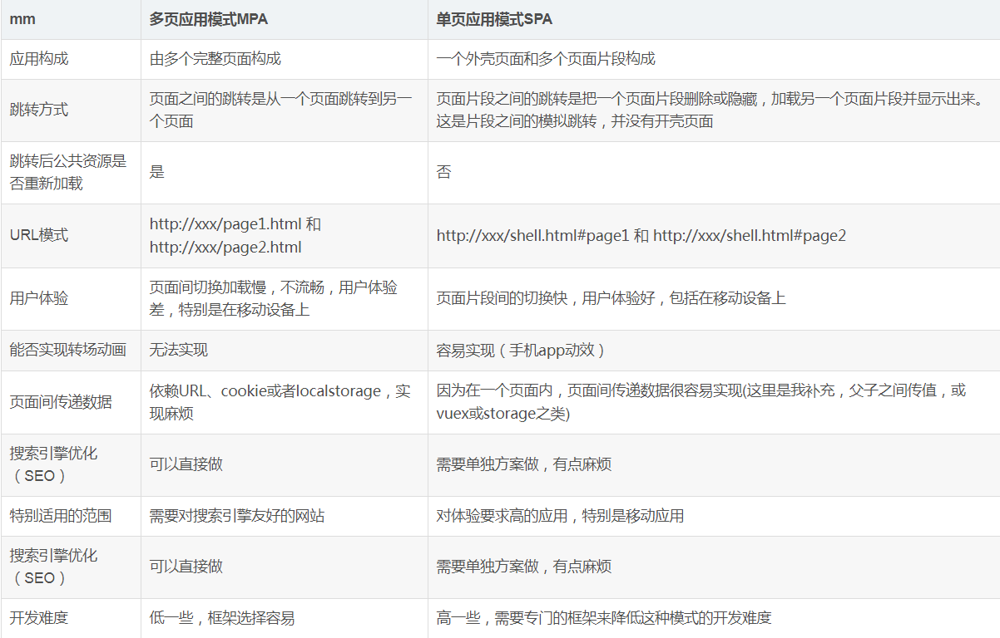

<!-- # input-ceshi

## Project setup
```
npm install
```

### Compiles and hot-reloads for development
```
npm run serve
```

### Compiles and minifies for production
```
npm run build
```

### Run your tests
```
npm run test
```

### Lints and fixes files
```
npm run lint
```

### Customize configuration
See [Configuration Reference](https://cli.vuejs.org/config/). -->

# 前端架构分享

## 开发框架
>vue.js [https://cn.vuejs.org/](https://cn.vuejs.org/)

>elementUl [https://element.eleme.cn/#/zh-CN/](https://element.eleme.cn/#/zh-CN/)

>axios.js [http://www.axios-js.com/](http://www.axios-js.com/)

>vue-router [https://router.vuejs.org/zh/](https://router.vuejs.org/zh/)

>vuex (具体看我们业务) [https://vuex.vuejs.org/zh/](https://vuex.vuejs.org/zh/)

>lodash.js [https://www.lodashjs.com/](https://www.lodashjs.com/)

## 开发工具
>nodeJS [http://nodejs.cn/](http://nodejs.cn/)

>npm [https://www.npmjs.cn/](https://www.npmjs.cn/)

>vue-cli [https://cli.vuejs.org/zh/](https://cli.vuejs.org/zh/)

>webpack [https://www.webpackjs.com/](https://www.webpackjs.com/)

## 我们会遇到的一些问题
+ 跨域
+ 权限验证

我们需要做的就是根据不同的权限生成不同的路由，在根据路由表生成导航栏，权限验证我觉得的分为两种情况；

1.每个页面的权限都是写死的；比如我们项目中有A,B,C,D四种权限，当我们新增一个页面的时候，我们就可以在他的路由中标明，这个页面A,B两个权限的人可以访问，假如用户登录的之后我们获取到用户的权限为A，我们就把这个A和本地的路由表过滤一遍，然后再最终生成路由。（这样做的话就必须要求我们得权限类型是固定的，只有ABCD四种权限，好处就是后端不需要知道前端有多少页面）

2.每个页面的权限都是可配置的；这种情况我们就需要从后端返回路由表，缺点就是我每次新增一个页面都需要后端配置路由和权限。

## 和我们目前项目的区别
我觉得最主要的区别就是页面之间跳转，我们现在的方式是在首页中使用ifram框架打开一个新页面，这样做有几个缺点，1是地址栏看不见当前页面的地址，2.刷新页面的时候目前打开的页面不会回到当前的内容页，因为我们是刷新的首页，必须右键点击重新加载框架。3.浏览器没有我们访问页面的历史记录。4.每次打开一个菜单都是是打开一个新页面，比较耗时。5.不能做页面间的转场动画。
用路由做跳转的话上面这些问题都没有，但是也有缺点。

## 单页应用与多页应用对比
